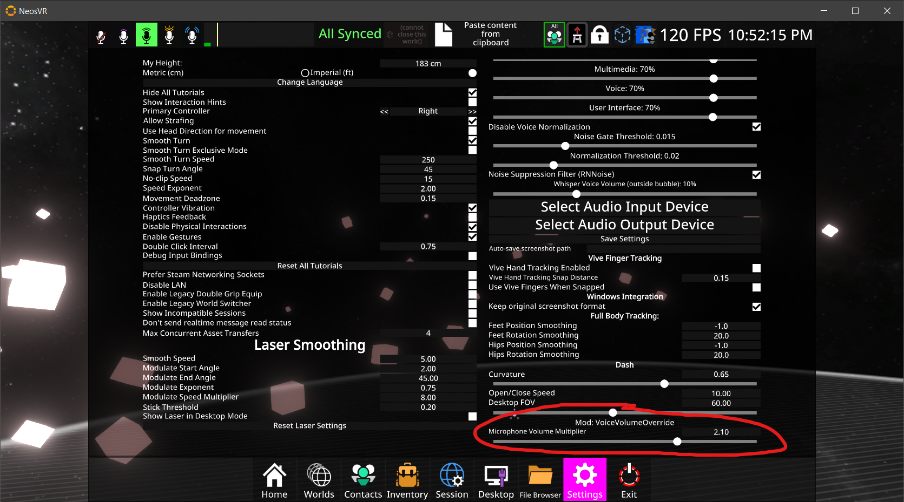

# VoiceVolumeOverride

A [NeosModLoader](https://github.com/zkxs/NeosModLoader) mod for [Neos VR](https://neos.com/) that allows you to adjust your microphone input volume in game.

This will no longer be needed once https://github.com/Neos-Metaverse/NeosPublic/issues/2656 is resolved.

## Installation
1. Install [NeosModLoader](https://github.com/zkxs/NeosModLoader).
1. Place [VoiceVolumeOverride.dll](https://github.com/zkxs/VoiceVolumeOverride/releases/latest/download/VoiceVolumeOverride.dll) into your `nml_mods` folder. This folder should be at `C:\Program Files (x86)\Steam\steamapps\common\NeosVR\nml_mods` for a default install. You can create it if it's missing, or if you launch the game once with NeosModLoader installed it will create the folder for you.
1. Start the game. If you want to verify that the mod is working you can check your Neos logs.

## Usage
Go to your settings and scroll all the way to the bottom of the right pane. You'll find a new "Microphone Volume Multiplier" there you can adjust. The setting will save automatically and persist across Neos launches.

## FAQ

### Doesn't the built in voice normalization do this automatically?
Yes, but sometimes you don't want normalization. For example, if you want to be able to whisper without being amplified up to shouting volume.

### Why is this needed?
Some microphone hardware is simply quieter than it needs to be. You can't turn your microphone up higher than 100% in Windows/SteamVR, so software amplification is needed.

### Why NeosModLoader over some other mod loader?
Because this does not violate the [Neos Guidelines](https://docs.google.com/document/d/1mqdbIvbj1b2LeFhNzfAASeTpRZk6vmbXISYLdTXTVR4/edit#).
